# Retail Customer Insights and Trial Evaluation (Quantium x Forage)

---
## 1. Project Background

A leading supermarket client sought insights into consumer purchasing behaviour within the snack foods category, with a particular focus on potato chips. The objective was to deliver data-driven recommendations to inform an upcoming category review. The analysis was conducted aiming to enhance their understanding of customer purchasing behaviour from July 2018 to June 2019 and evaluate the effectiveness of targeted in-store trials. 

This involved two primary components:
1. **Customer Insights and Segmentation:**
Analysis of transaction and customer data to identify key drivers of chip sales, uncover purchasing trends, and segment customers by value and behaviour. Data preparation included cleaning, merging, and deriving key variables to support actionable insights.
2. **Evaluation of In-Store Trials:**
Selection of control stores and assessment of performance across three trial stores. This phase focused on measuring the impact of strategic in-store initiatives against defined KPIs, using matched controls and pre/post comparisons to determine effectiveness.

The findings from both phases were consolidated into a recommendation for the category team, with a focus on targeting high-value customer segments, optimising product formats, and assessing the commercial viability of scaling the trial initiatives.

---
## 2. Executive Summary

### Part 1: Customer Segmentation Insights

An analysis of 265,000 records from July 2018 to June 2019 shows an annual revenue of approximately $1.8 million from chip sales across 271 stores, with 71,517 loyalty card members. Budget older families are the largest contributors, accounting for 8.7% of total revenue. Their top purchase is Kettle brand chips, spending 48% more on Kettle than the second-most purchased brand, Smiths. They are also 26% more likely to purchase RRD and 18% less likely to purchase Tostitos compared to the general population.

Mainstream young singles/couples are the highest spenders per chip packet, spending an average of $4.05 per packet. Their top brand is also Kettle, where they spend 69% more on Kettle than the second-most purchased brand, Doritos. This group is 23% more likely to purchase Tyrells and 55% less likely to buy Burger Rings compared to the rest of the population. They also tend to prefer larger chip sizes (270g, 380g, 330g), which could indicate they are balancing savings with a preference for premium brands.

To capitalise on key customer segments, the category team should prioritise tailored strategies for both revenue contribution and profitability. For Budget Older Families—who drive the highest total revenue—this includes optimising promotions and shelf placement for Kettle and RRD chips, especially 180g pack sizes. For Mainstream Young Singles/Couples—who spend the most per chip packet—opportunities lie in promoting premium brands like Tyrrells and Kettle, and offering value in larger pack sizes. These targeted actions will help increase sales volume from high-revenue segments and maximise profit margins from high-spend-per-unit customers.

### Part 2: Trial Store Impact Summary

The trial period led to a measurable uplift in performance for stores 77 and 88, though through different mechanisms. Store 77 saw a significant increase in monthly customer count, indicating the trial attracted new shoppers. In contrast, store 88 showed a significant rise in transactions per customer, suggesting improved engagement from existing customers. Store 86, however, showed no significant difference compared to its control, indicating limited trial impact. These results support the trial's effectiveness overall and highlight store-specific strategies worth investigating further.

---
## 3. Data Overview

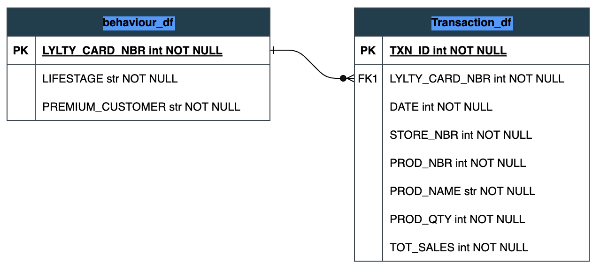

The dataset includes transaction records and customer behavior details across multiple stores. The data spans a variety of customers, providing valuable insights into purchasing behavior and demographics. To prepare the dataset for analysis, several steps were undertaken to ensure its integrity and usability:

1. Handling Missing Values: Missing data was either imputed or removed to ensure consistency and completeness.
2. Outlier Detection: Identified and addressed outliers to avoid distortion in analysis.
3. Feature Engineering: Additional features, such as pack size, were derived to enhance the analysis.
4. Data Type Conversion: Corrected data formats, such as converting dates from strings to datetime objects for proper analysis.
5. Categorical Transformation: Some string columns, including lifestage and premium_customer, were converted to categorical variables to optimize performance and memory usage.

These transformations ensure that the dataset is well-structured and ready for comprehensive analysis, allowing for deeper insights into customer behavior and purchase patterns.

---
## 4. Key Insights Deep Dive

## Part 1: Customer Segmentation Insights

### Overview of Customer Segmentation

Customers were segmentated using two attributes
- LIFESTAGE: Customer attribute that identifies whether a customer has a family or not and what point in life they are at e.g. are their children in pre-school/primary/secondary school.
- PREMIUM_CUSTOMER: Customer segmentation used to differentiate shoppers by the price point of products they buy and the types of products they buy. It is used to identify whether customers may spend more for quality or brand or whether they will purchase the cheapest options.

These attributes lead to the following segmentation:
| LIFESTAGE    | 
|--------------|
| Midage singles/couples |
| New families           |
| Older families         |
| Older singles/couples  |
| Retirees               |
| Young families         |
| Young singles/couples  |

| PREMIUM_CUSTOMER | 
|------------------|
| Budget           |
|Mainstream        |
|Premium           | 

The population distribution is as follows:
- Budget older families are the largest customer segment, accounting for 8.7% of the total population.
- Premium new families are the smallest customer segment, accounting for 0.6% of the total population.

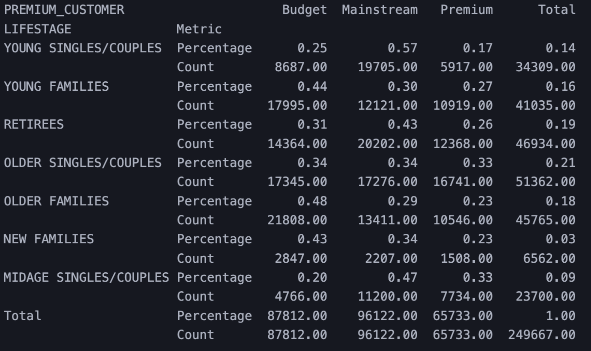
  

### Revenue Contribution by Segment

This section examines the revenue contribution from each LIFESTAGE and PREMIUM_CUSTOMER segment. By analyzing these segments, we can identify the groups driving the most sales and understand where focus should be placed to maximize revenue.

- Total revenue is $1,819,778.
- _**Budget older families**_ account for the largest percentage of total sales - 8.7%, contributing $158,380 to the yearly revenue.
- Mainstream young singles/couples and mainstream retirees are second and third, making up 8.2% and 8.0% of total revenue respectively.

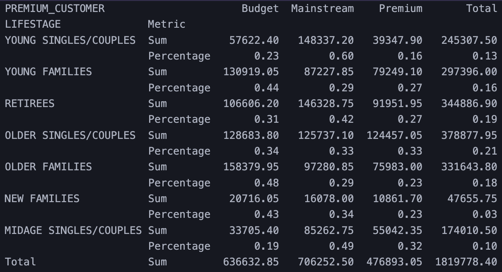

**Favorite Brand for Top Contributor**

- Kettle brand drives the biggest sales for budget older families.
- Budget older families spend 48% more on Kettle brand than the second most purchased brand, Smiths.

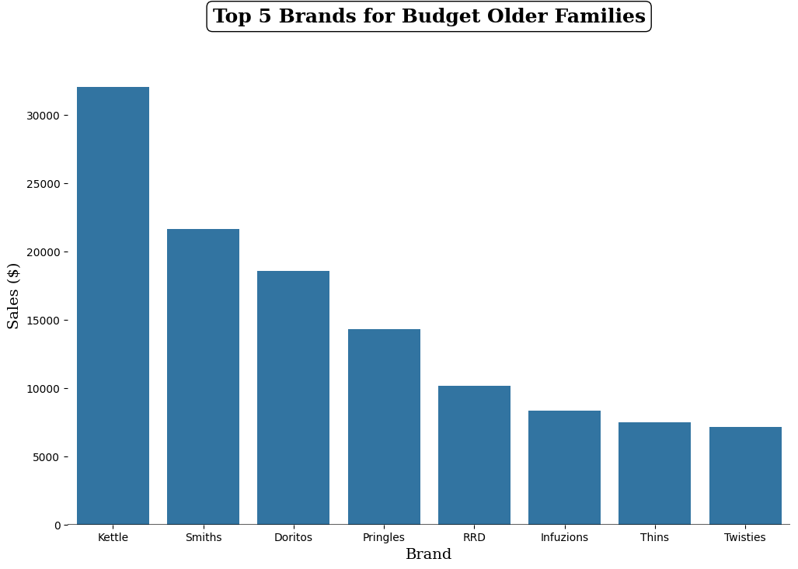

**Brand and Size Preferences Relative to Population**

This section examines the brand and size preferences of budget older families in comparison to the general customer population. To identify which brands and sizes budget older families are more likely to purchase, we calculated the relative preference for each product based on the frequency and volume of their purchases.

- Budget older families are 39% more likely to purchase 180g packet sizes.
- Budget older families are 11% less likely to purchase 134g packet sizes.
- On average, this segment shows more of an inclination towards smaller pack sizes, suggesting they may prioritize more convenient or affordable options.

Grain Waves and Pringles are the only brands that offer 180g and 134g packets respectively. These size preferences might therefore reflect a higher or lower likelihood to purchase these specific brands. We will see if this is the case below.

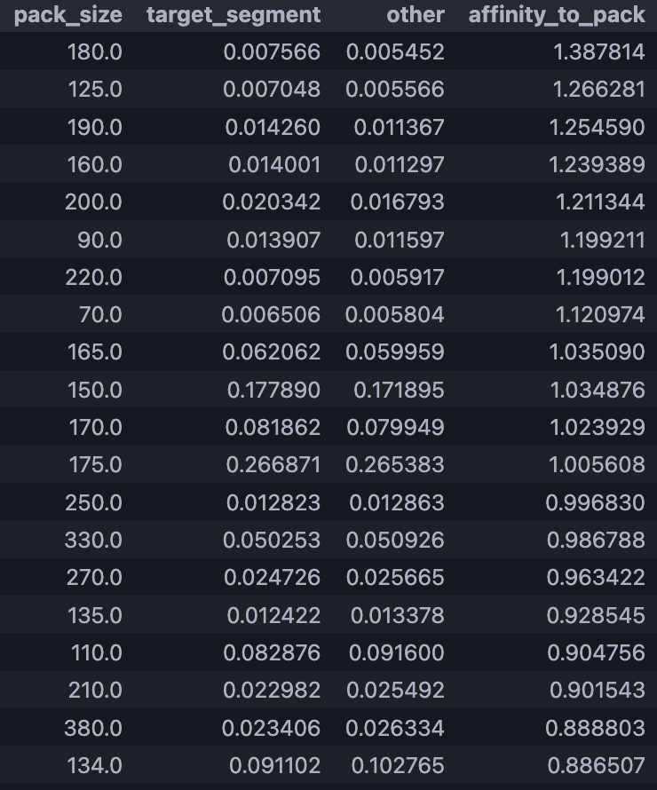

The brands that that budget older families are most and least likely to purchase include:
- RRD 26% more likely.
- Tostitos 18% less likely.

Taking into account the size preferences we observe:

- Regardless of size Pringles in general are 11% less likely to be purchased.
- Grain Waves in general are purchased at roughly the same likelyhood as the rest of the population. It is only the smaller, 180g, Grain Waves packets which they tend to purchase more relative the rest of the population.

This again indicates a preference for smaller, more affordable packs, which could align with the budget-conscious nature of this segment.

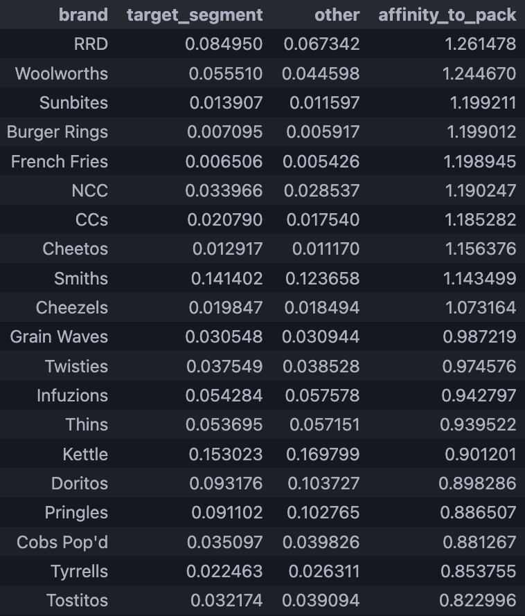

---

### Profitability Contribution by Segment

This section examines the revenue contribution from each LIFESTAGE and PREMIUM_CUSTOMER segment, focusing on the groups that spend the most on average per chip packet. By identifying these segments, we can better understand where to focus efforts to maximize profit.

- Mainstream young singles/couple spend $4.05 per pack.
- Mainstream midage singles/couple spend $3.98 per pack
- Premium retirees spend $3.91 per pack.
- Budget young singles/couples spend the least at $3.64 per pack.

A t-test confirmed significant differences among the top three spenders, adding credibility to these insights.

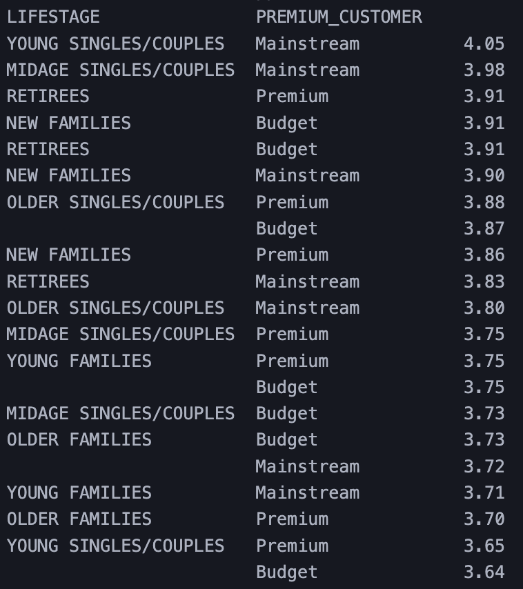

**Favorite Brand for Top Contributors**

- All three highest-paying segments purchase Kettle the most, followed by Dorito
- Mainstream young singles/couples spend 69% more on Kettle than on Doritos, showing a strong brand preference.

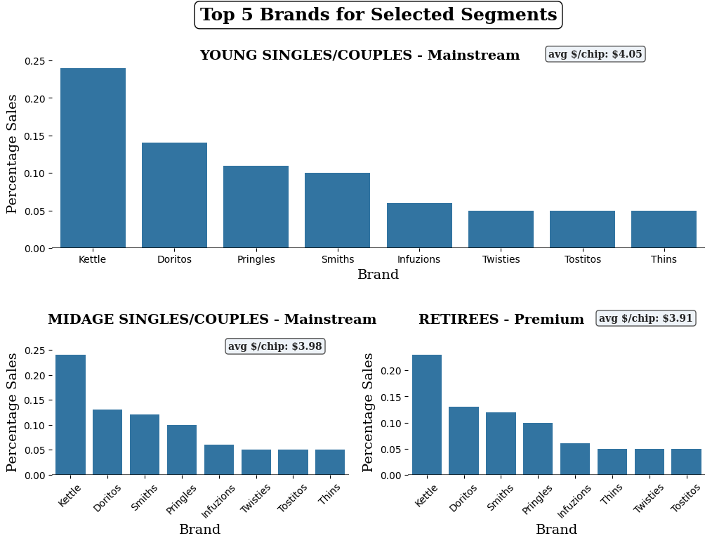

**Brand and Size Preferences Relative to Population**

This section explores the brand and size preferences of the highest-spending segment — mainstream young singles/couples — in comparison to the overall customer population. To identify which products this group is more or less likely to purchase, we calculated the relative preference for each product based on the frequency and volume of their purchases.

 - They are 27% more likely to purchase 270g packs and 25% more likely to purchase 380g packs.
 - They are 55% less likely to purchase 220g packs and 51% less likely to purchase 70g packs.
 - Overall, this segment shows a clear preference for larger pack sizes, suggesting a tendency toward bulk buying or value-driven shopping.

It's worth noting that Twisties and Burger Rings are the only brands offering the 270g and 220g sizes, respectively. Therefore, to accurately interpret these size preferences, we also need to consider this segment's brand preferences — as the trend may reflect brand affinity rather than size alone.

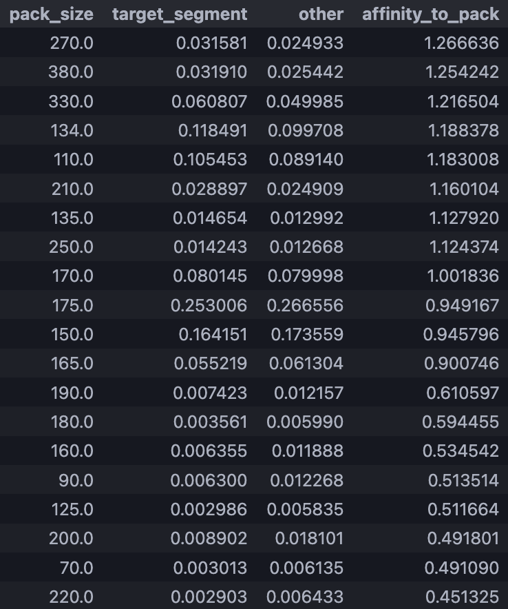

The brands that mainstream young singles/couples are most and least likely to purchase include:

- Tyrells are 23% more likely to be purchased.
- Burger Rings are 55% less likely to be purchased..

When considering size preferences alongside brand choices, we observe:

- Burger Rings are only available in 220g packs — a size this segment is significantly less likely to purchase. This suggests the low preference is driven by brand, not just pack size.
- Twisties are the second most preferred brand among this group, and they are the only brand offering 270g packs. This reinforces the idea that the preference for 270g sizes may reflect a strong brand preference for Twisties rather than size alone.

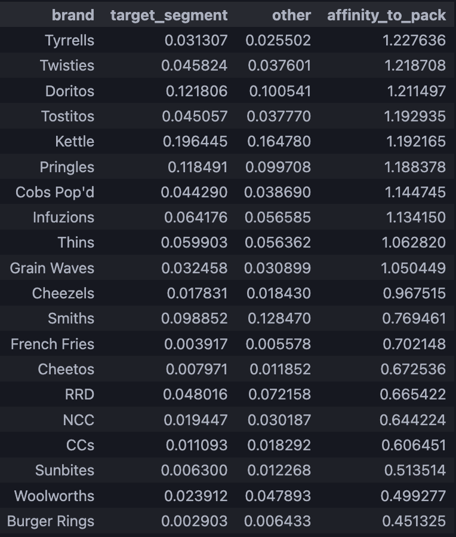

## Part 2: Trial Store Analysis

The Category Manager has asked us to test the impact of the new trial layouts with a data driven recommendation to whether or not the trial layout should be rolled out to all their stores. Here, we will ecaluate the performance of a store trial which was performed in stores 77, 86 and 88 over the period 01-Feb-2019 - 30-Apr-2019.

### Selcting Control Stores

To evaluate the impact of the trial layout, we selected control stores that closely resembled each trial store in both sales trends and customer demographics prior to the trial period. The goal was to ensure any observed differences during the trial could be attributed to the layout change, rather than natural variation between stores.

**Method and KPIs for Selection**

The control stores were selected using the following method:
- The pre-trial period was defined as 01-Jul-2018 to 31-Jan-2019.
- For each trial store, we compared all other stores based on the following metrics:
  - Monlthy sales during the pre-trial period.
  - Monthly number of customers.
  - Monthly average transaction per customer.
- A similarity score was calculated using an equal weighting of the Pearson correlation coefficient (to capture trend similarity) and a standardized distance metric (to assess absolute differences)
- This score allowed us to identify the most appropriate control store for each trial store based on overall similarity across the selected KPIs.

The highest score corresponding to each trial store is as follows:

| Trial Store | Control Store |
|-------------|---------------|
| 77          |  233          |
| 86          |  219          |
| 88          |  237          |

Below, we present a comparison of the selected KPIs between each trial store and its matched control store during the pre-trial period. This highlights the degree of alignment prior to the trial and supports the validity of our control selection.

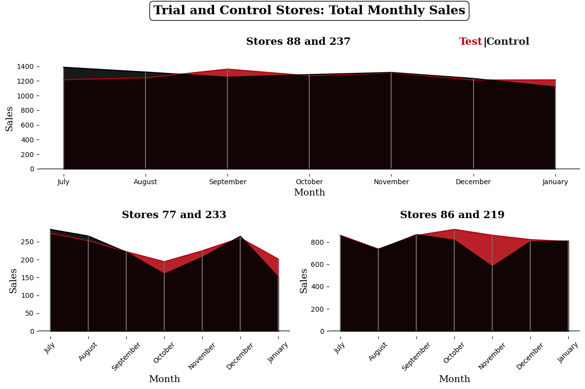

---

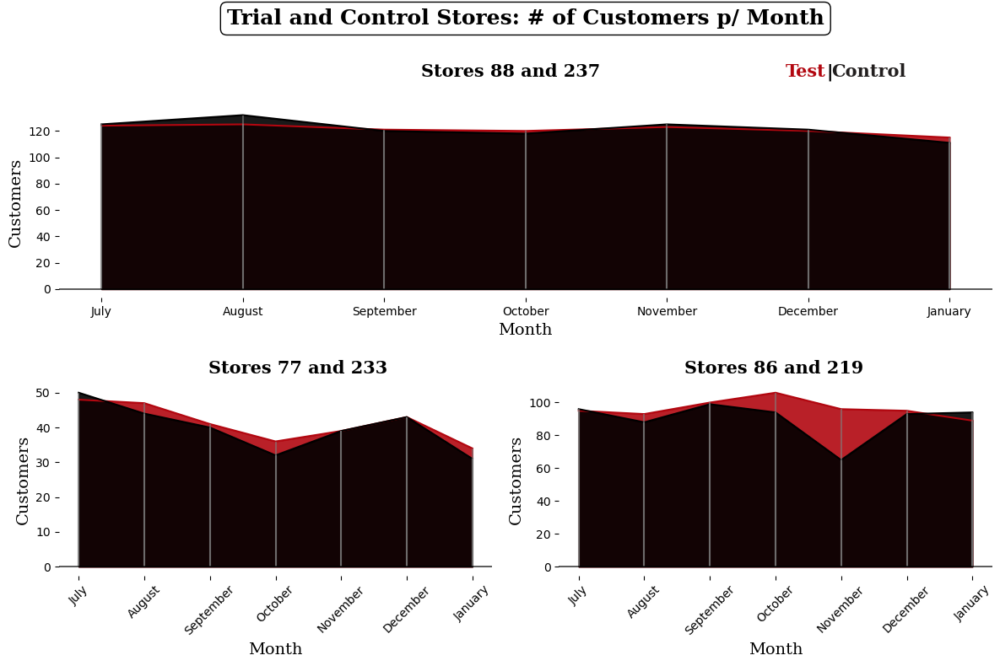

---

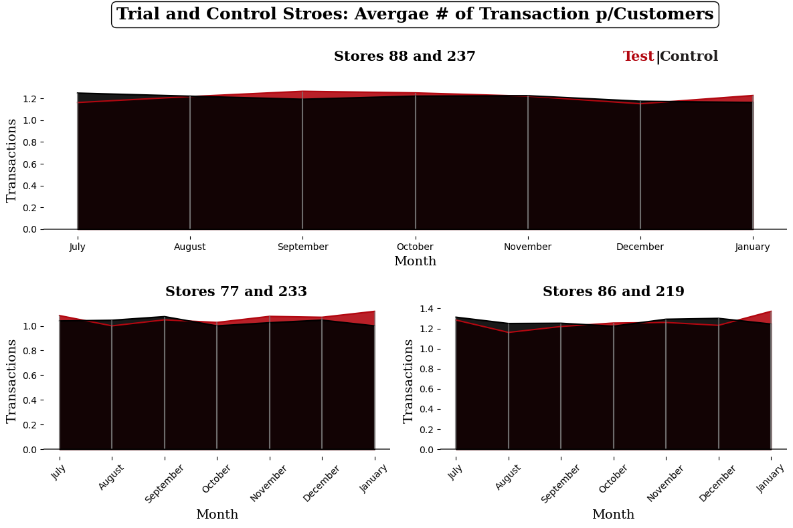

---

### Assessment of the Trial

**Statistical Testing for Significance**

To determine whether the differences in performance between trial and control stores were statistically significant during the trial period, we used the following method:
1. **Scale Alignment:**
   For each KPI, we calculated a scale factor by dividing the total pre-trial metric of the trial store by that of the control store. This ensured the two stores were on a comparable scale.
2. **Percentage Difference Calculation:**
   For each month, we computed the percentage difference between the trial and control store KPIs, scaled appropriately.
3. **Estimate of Variability:**
   We calculated the standard deviation of the monthly percentage differences over the pre-trial period. This served as our estimate of normal variation.
4. **t-Statistic Computation:**
  During the trial period, we computed the average percentage difference and then calculated a t-value using:

$t = \frac{\text{Percent\ difference of trial period}}{ \text{std. dev. of pre-trial diffs}}$

6. **t-Critical Threshold:**
   We obtained the t-critical value for a 95% confidence level, with degrees of freedom equal to the number of pre-trial months minus one.
7. **Statistical Significance:**
  If the absolute t-value exceeded the critical threshold, we concluded that the difference in performance during the trial was statistically significant.

**Store 77**

Monthly total sales indicate that the trial layout in Store 77 performed significantly better than its control store during the trial period, with sales falling outside the 5% to 95% confidence interval in two out of the three trial months.

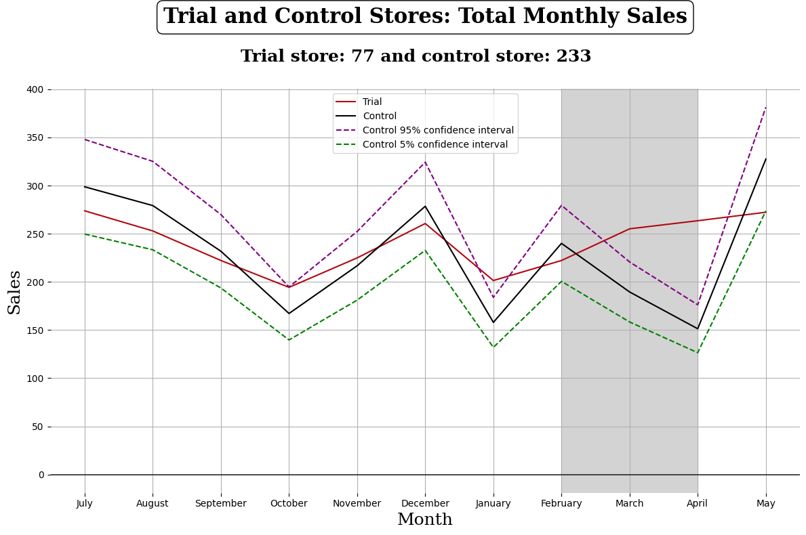

The number of customers is significantly higher in two of the three months. This seems to suggest that the trial had a significant impact on increasing the number of customers in trial store 77.

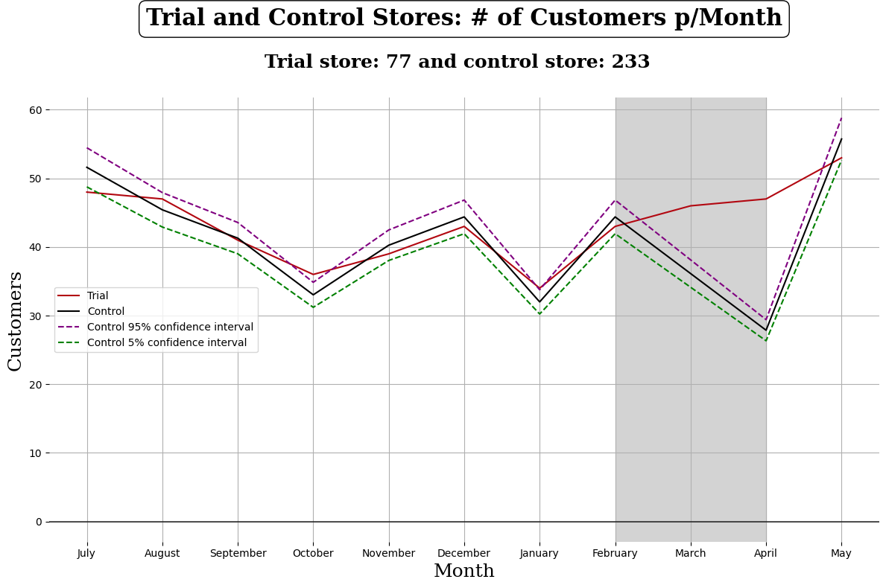

The results show the average number of transactions per customers in the trial store 77 is not significantly different to its control store in the trial period as the trial store performance lies inside the 5% to 95% confidence interval of the control store in all three trial months.

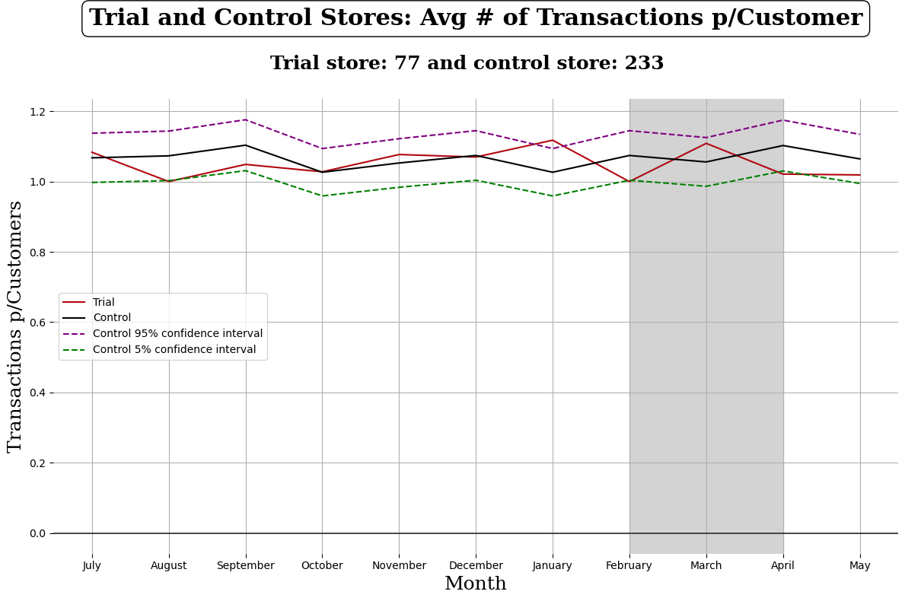

The trial layout in store 77 resulted in significant increases in the number of customers and total sales in at least two of the three trial months. However, there was no significant change in the average number of transactions per customer. This suggests that the layout was effective in attracting more customers, but it did not lead to more frequent purchases among existing ones. The overall boost in sales during the trial period was therefore likely driven by increased foot traffic rather than changes in purchasing behavior.

---

**Store 86**

The monthly total sales show that the trial layout in store 86 is not significantly different to its control store in the trial period as the trial store total sales performance lies indside the 5% to 95% confidence interval of the control store in all three trial months.

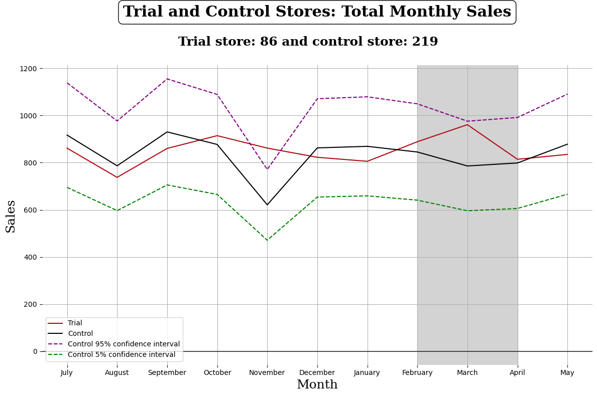

Monthly number of customers also stayed within the confidence interval, showing no significant deviation from the control

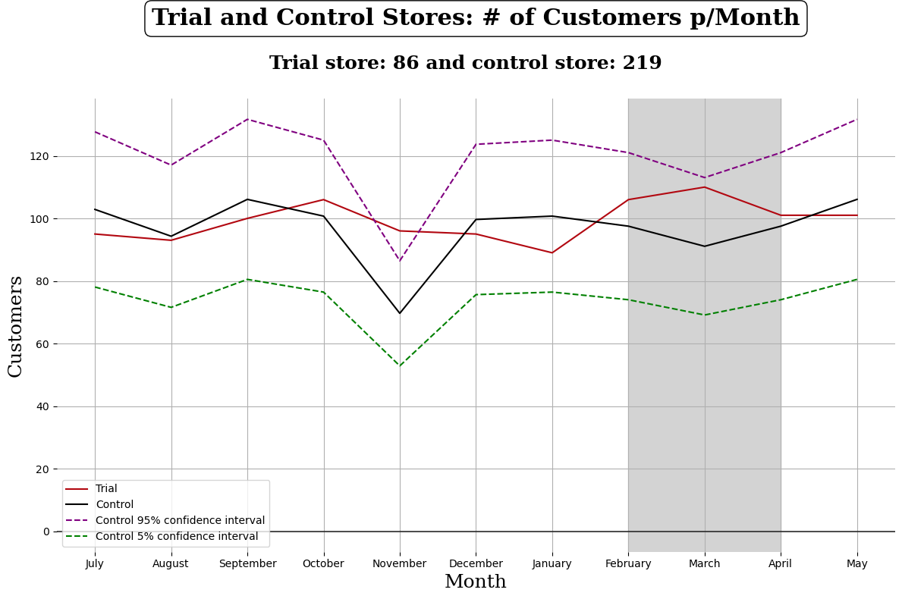

Average transactions per customer followed a similar trend, with performance consistently within the confidence bounds

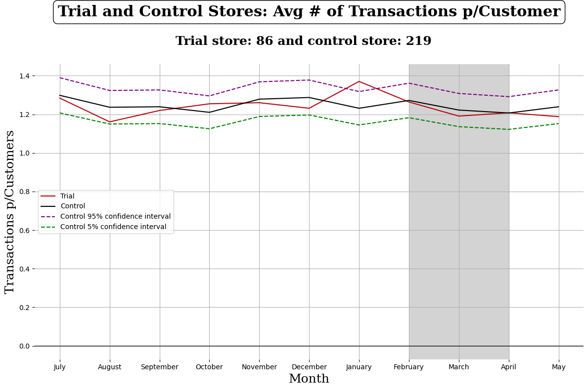

The trial layout implemented in store 86 did not lead to any statistically significant differences in customer behavior or sales outcomes compared to its matched control store.

---

**Store 88**

The monthly total sales show that the trial layout in store 88 lead to significantly higher total sales compared to its control store in the trial period as the trial store performance lies outside the 5% to 95% confidence interval of the control store in two of the three trial months.

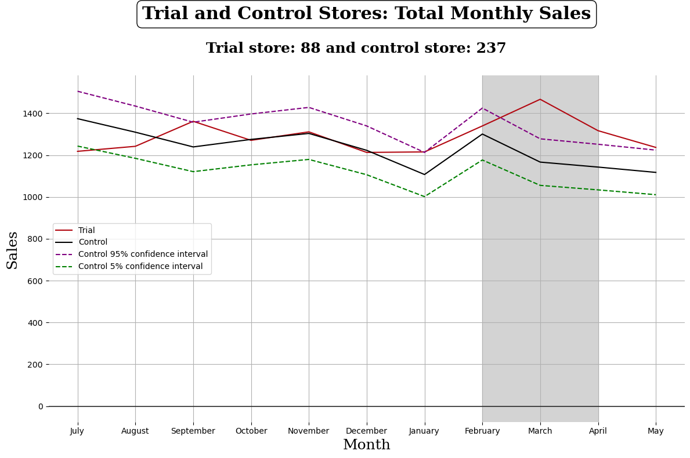

The results show the number of customers in trial store 88 is not significantly different to its control store in the trial period as the trial store performance lies inside the 5% to 95% confidence interval of the control store in two of the three trial months.

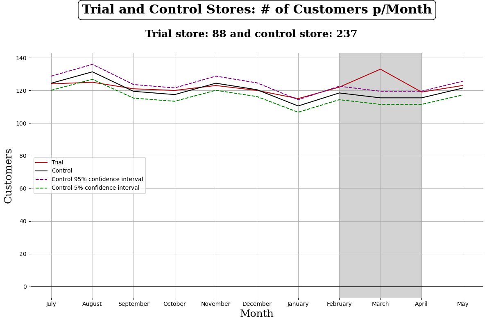

The results show the average number of transactions per customers in the trial store 88 is significantly higher to its control store in the trial period as the trial store performance lies inside the 5% to 95% confidence interval of the control store in two of the three trial months.

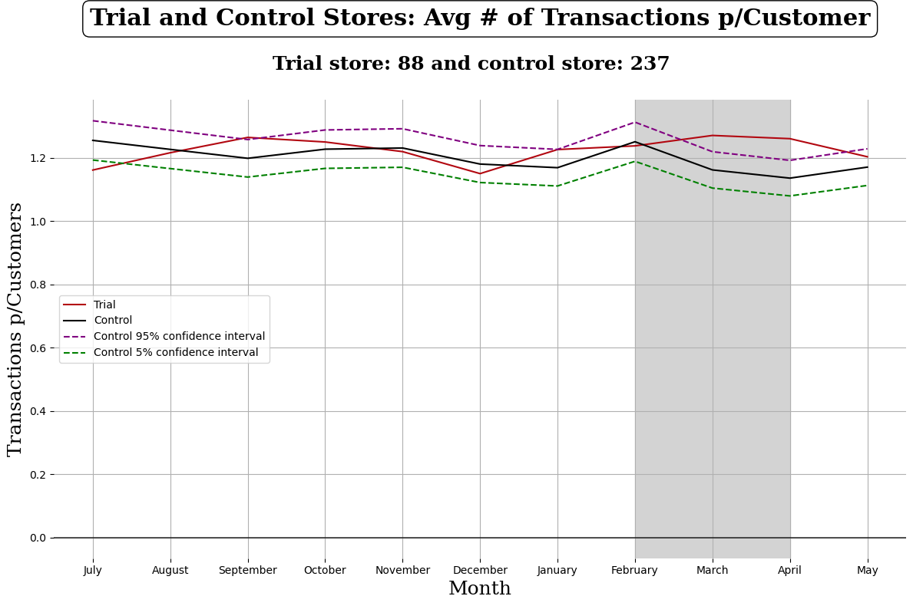

The trial layout in Store 88 led to significant increases in total sales and transactions per customer in at least two of the three trial months. However, there was no significant change in the number of customers. This suggests that while the layout did not attract new customers, it effectively encouraged existing customers to purchase more frequently, resulting in higher overall sales during the trial period.

---
## 5. Recommendations

### Part 1. Customer Segmentation Insights

**Targeting Budget Older Families for Revenue Growth:**
- <ins>_**Leverage brand preferences:**_</ins> This segment spends 48% more on Kettle than the second most-purchased brand, indicating a strong preference for this premium brand.
- <ins>_**Focus on medium to small-sized, affordable packs:**</ins>_ This segment is more likely to purchase medium to smaller packs, likely due to their focus on affordability. Promoting more affordable pack sizes will cater to their preferences effectively.
- <ins>_**Encourage variety in smaller pack sizes:**</ins>_ This segment is 26% more likely to purchase RRD than the rest of the population, showing a preference for this brand as well. Positioning RRD in medium to small pack sizes could be an attractive offering for them.

**Targeting Mainstream Young Singles/Couples to Maximize Profits:**
- <ins>_**Highlight strong brand preferences:**_</ins> This segment spends 69% more on Kettle than the second most-purchased brand, Doritos, showing a clear preference for Kettle. 
- **_<ins>Promote larger pack sizes:**_</ins> Given that this segment is more likely to purchase larger packs like 380g/330g, focus on promoting bulk buying and the value associated with these larger sizes.
- **_<ins>Introduce bundles or discounts:**_</ins> Offering discounts or bundles on larger packs will incentivize this segment to buy more, catering to their preference for bulk purchasing and value.
- **_<ins>Emphasize premium brands:**_</ins> Their inclination towards Tyrells compared to the rest of the population suggests an opportunity to push this premium brand in larger sizes for a more profitable segment.

These recommendations are based on segment-specific spending behavior and brand/size preferences, which offer targeted ways to enhance revenue and profitability by aligning offerings with customer tendencies.

### Part 2: Trial Store Analysis
***Store 77:***
The trial layout resulted in statistically significant increases in both customer numbers and total sales in at least two of the three trial months. Although transaction frequency per customer remained unchanged, the higher customer volume led to greater overall sales.
**_<ins>Recommendation:**_</ins> Roll out the layout to similar stores where increasing customer footfall is a strategic goal.
**Store 88:**
The trial led to significant increases in transaction frequency and total sales, though the number of customers remained unchanged. This suggests improved shopping behavior among existing customers.
**_<ins>Recommendation:**_</ins> Roll out the layout in stores aiming to deepen engagement and drive higher spend per customer.
**Store 86:**
There were no statistically significant differences in any KPI during the trial. Performance remained within the control store’s confidence interval throughout.
**_<ins>Recommendation:**_</ins> Do not proceed with a rollout for trial store 86 layout at this stage. However, further investigation is recommended to understand the lack of impact. 
**_<ins>Consider:**_</ins>
- Whether the layout was implemented consistently.
- Store-specific factors that may have limited the trial's effectiveness.
- Gathering qualitative feedback (e.g. customer/staff input) to inform any adjustments.

---
## 6. Clarifying Questions, Assumptions & Caveats

